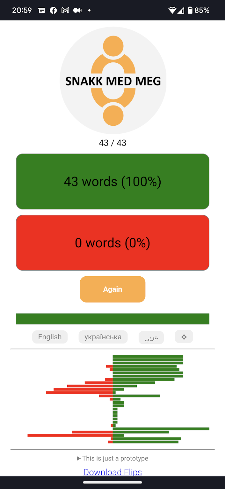

# Flip

This is a prototype of an app to help you learn Norwegian.

This prototype has:
- 100 words
- English, Ukranian and Arabic

What is planned:
- a way to add your own words
- a way to export and import word-lists

Try it out at https://flip.fred.technology/

Give feedback and suggest features to me at 
fredpallesen@gmail.com